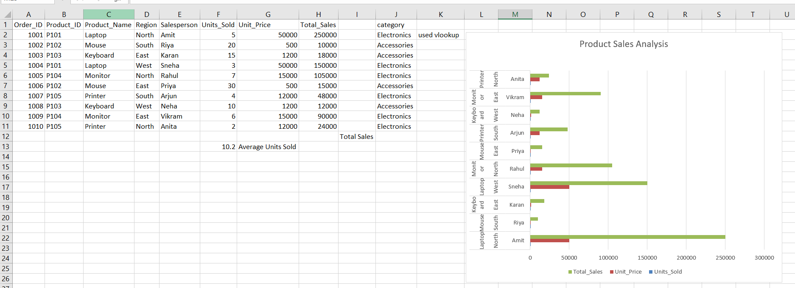
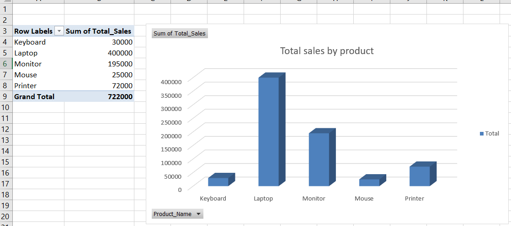
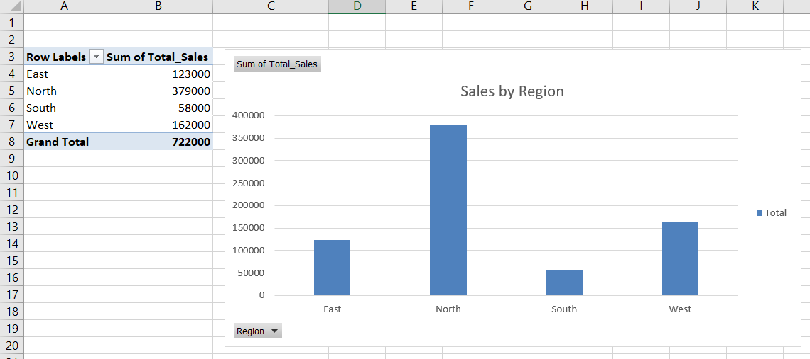

Project Title: Sales Data Analysis using Excel

Description:
This project analyzes a sample sales dataset using Microsoft Excel.
The goal is to understand product performance and regional sales trends.
## Sales Data

## Pivot Table

Tasks Performed:

• Calculated total sales using SUM formula
• Found average units sold using AVERAGE
• Used VLOOKUP to retrieve product category information
• Used HLOOKUP to analyze monthly sales data
• Created Pivot Tables to summarize sales by product and region
• Built charts for data visualization

Tools Used:
Microsoft Excel

Skills Demonstrated:
Data Analysis, Excel Formulas, Pivot Tables, Data Visualization
